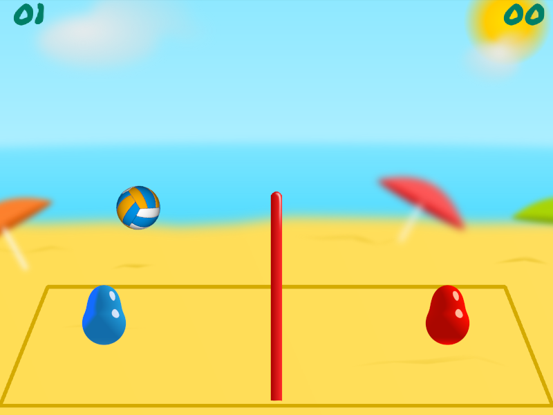

[](https://circleci.com/gh/RustyVolley/RustyVolleySrc)



# What is this?

A rewrite of [Blobby Volley 2](https://sourceforge.net/projects/blobby/) written in [Rust](https://www.rust-lang.org/), a blazingly fast, memory safe, thread safe language. This project can be compiled to native application and also [Web Assembly](https://webassembly.org/), a binary instruction format for a stack-based virtual machine.

> That is too much buzzwords for me, show me some stuff already!

[Here you go!](https://rustyvolley.github.io/WebDemo/)

# How to play?

Use the mouse in the menu. To control player 1, use W, A and D. To control player 2, use the arrow keys.

# Compiling and running it


## 1. Get the tools

You need Rust nightly to compile this beauty:

```sh
rustup toolchain install nightly-2019-12-20
rustup default nightly-2019-12-20
```


Also, you will need cargo-web if you want to run it in your web browser:

```sh
cargo install cargo-web
```

## 2. Compile and run the game

To run it in with WebAssembly do:

```sh
cargo web start
```
Then go to [http://[::1]:8000](http://[::1]:8000) to see it in action.

If you only want to generate the files for building a web release do:
```sh
cargo web deploy --release
```

Also, you can run it in a desktop window with:
```sh
cargo run --release
```
